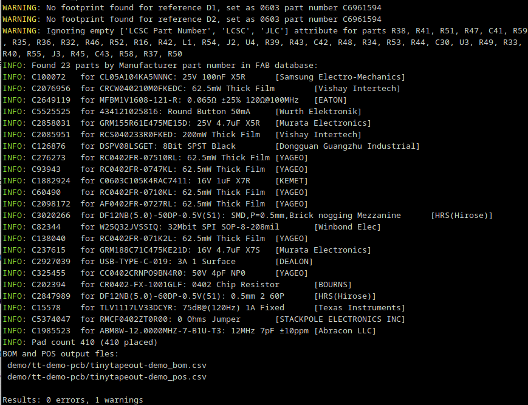
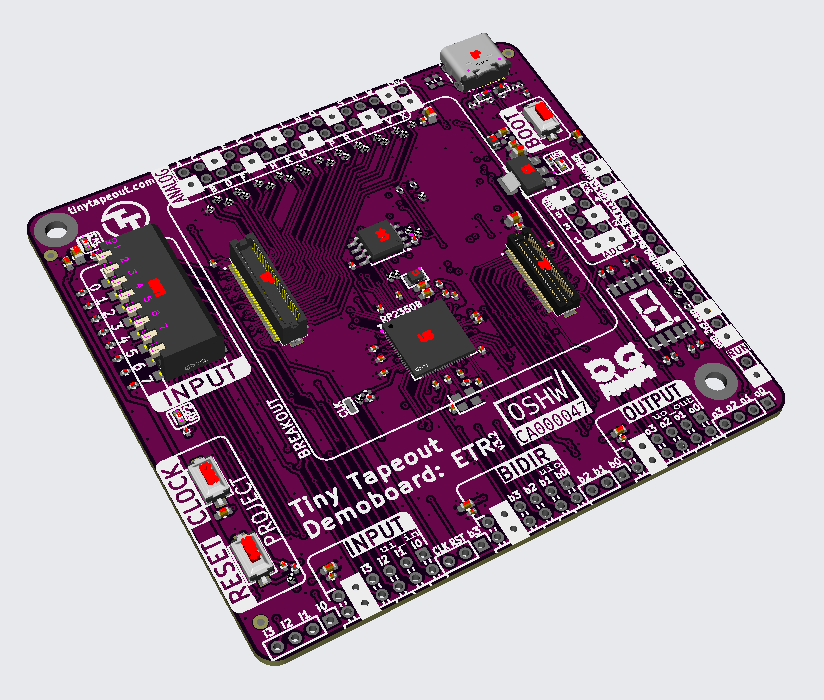
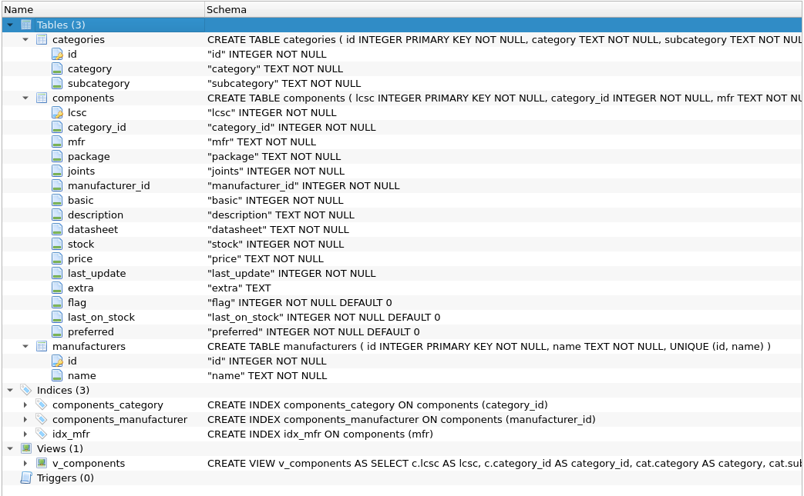

# Fabrication files generator tool

This tool allows you to automatically generate BOM and POS files _just from a .kicad_pcb file_. It will look into a database of components to get the corresponding part ID right from the Manufacturer Part Name, which is independent on the fab. For example, the LCSC part number if the fab is JLCPCB. This way, you need to set only the MPN field in the schematics file. Passives does not need a MPN field, the part is selected from the footprint and value.
  
As a plus, if you have a panel of equal or different boards, it will rename duplicate designators. This is especially handy since with Kicad's Pcbnew you can aggregate different PCBs, but the link to the schematics files is lost.

## Generate BOM and POS files

Run the tool. It will generate the .csv files, and list any errors or warnings. As an example, it will use the [Tinytapeout Demo board](https://github.com/TinyTapeout/tt-demo-pcb/)
  

    $ python fabgen.py demo/tt-demo-pcb/tinytapeout-demo.kicad_pcb
  
</img>

## Generate gerbers

This can be done with [Kikit](https://github.com/yaqwsx/KiKit)
  
    $ cd demo/tt-demo-pcb
    $ python3 -m kikit.ui export gerber tinytapeout-demo.kicad_pcb .
    $ zip tinytapeout-demo.zip tinytapeout-demo-* tinytapeout-demo.*

## Send to FAB
Upload your zip with the Gerber, and the gnerated BOM and POS files. You'll get something like this:
  

</img>

**Note**: most ICs and connectors will require rotation, since the database has some bugs. Some component have offsets and rotation corrected by the tool, but they are needed to be added by hand in the python script.

## Component database
The tool requires a file named **cache.sqlite3**. See [this project](https://github.com/yaqwsx/jlcparts) to know about the format. Note that a full component database may require multiple GBs of storage. This project doesn't provide the database, but you may be able to find it pre-made.

</img>

It is **HIGLY RECOMMENDED** to create an index on the components tables to get useable speeds You can use python for this:

    import sqlite3
    conn = sqlite3.connect("cache.sqlite3")
    cursor = conn.cursor()
    cursor.execute('CREATE INDEX idx_mfr ON components (mfr)')

This needs to be run just once.
  

# About NLnet Foundation

</img>

This project [is partially funded](https://nlnet.nl/project/2D-graphics-hardware/) through the NGI0 Entrust Fund, a fund established by NLnet with financial support from the European Commission's Next Generation Internet programme, under the aegis of DG Communications Networks, Content and Technology under grant agreement No. 101092990.

